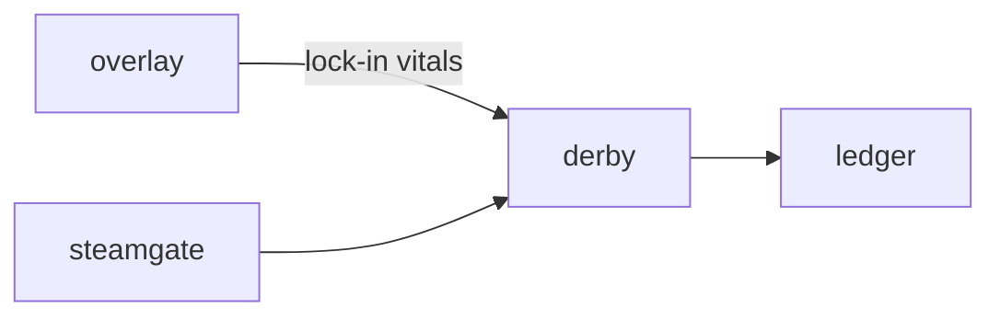

# Derby

**Pet Racing Derby** — Multiplayer race where stats, mood, and stamina dictate speed — not pay-to-win nitro.

Part of [ComputerPets](https://github.com/RicheyWorks/computerpets). Map: [computerpets-ecosystem](https://github.com/RicheyWorks/computerpets-ecosystem).

| | |
| --- | --- |
| Status | Design scaffold — loop and engine frozen |
| License | MIT |
| Tokens | Minigames never mint or burn. Tired overlay, not a dead lineage. |
| First pet | [Meet Rui first](https://github.com/RicheyWorks/computerpets/blob/main/docs/START-HERE.md). This game is optional. |

## The loop

A starving Rui does not win. Derby reads overlay vitals at lock-in. NFT gear can change drag, not spawn a faster species.

## Who plays

Six players, one pet each, lock-in vitals.

## What it is not

Pay-nitro. A starving Rui does not win. Unreal is optional; WebGL exists.

## Genre and engine

- Genre: **Arcade racing**
- Engine: **Unreal / WebGL fallback**
- Stack: Unreal Engine 5 · Chaos vehicles-lite · WebGL fallback in Three.js · mood/stamina as speed
- Default surface: `UE editor / 8080`

## Architecture



## How you play

1. Lobby of 6. One pet each.
2. Track biome per species week (forest, reef, pond).
3. Stamina drain; mood = cornering.
4. Photo finish is server-authoritative.

## First slice

Build this and stop.

**WebGL oval, stamina drain, server-authoritative photo finish.**

You know it works when: Disconnect: ghost 3s then DNF. Cheat stamina: reject snapshot.

## Environment

UE5 or Node 22 fallback

## Failure doctrine

Disconnect → ghost the last inputs 3s then DNF. Unreal too heavy → WebGL fallback track. Cheating stamina → reject lock-in snapshot.

Canon rules that never yield:

- 210 living kinds. No illegal hybrids.
- Overlay pets can get tired, sick, or hide. Tokens are not burned by a minigame.
- Desktop walk stays the main quest. Closing Derby must leave Rui walking.

## Neighbors

- computerpets (vitals at lock-in)
- computerpets-visitation (lobby)
- computerpets-ledger (entry fee / purse)
- computerpets-steamgate

## Layout

```
computerpets-derby/
  README.md
  LICENSE
  docs/DESIGN.md
  src/                implementation lands here
```

## Run (Windows)

```powershell
UE5: open Derby.uproject. Fallback: cd webgl && npm run dev
```

Meet Rui first via the [flagship start-here](https://github.com/RicheyWorks/computerpets/blob/main/docs/START-HERE.md). This game is optional.

## Links

- Flagship: [RicheyWorks/computerpets](https://github.com/RicheyWorks/computerpets)
- This repo: [RicheyWorks/computerpets-derby](https://github.com/RicheyWorks/computerpets-derby)
- Map: [RicheyWorks/computerpets-ecosystem](https://github.com/RicheyWorks/computerpets-ecosystem)
- Design file: [docs/DESIGN.md](docs/DESIGN.md)

## License

MIT. See [LICENSE](LICENSE).

---

*Two hundred ten living kinds. Keep them so a line does not go quiet.*
